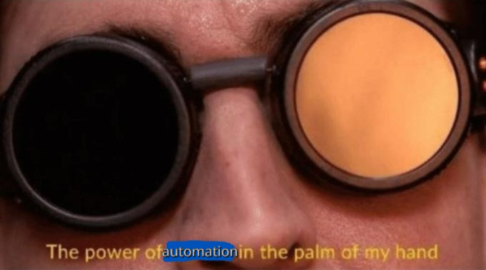

# plot_summary_webscraper
While finishing up the video player I made to play the show "The Office" (https://github.com/BenTheurich/VideoPlayer) I found myself navigating through the same webpages, copying text, and then formatting it correctly to create the tooltip description for each episode. 

After I got halfway done, I realized "I'm a software engineer woking in test *automation*! Why on earth am I sitting here doing a repetitive task?"

Thus, plot_summary_webscaper was born. This python script uses selenium to extract text I need from the web, then adds line breaks and formats it into a Java 2D array, which is the format I need for my video player project.

This program completed a task that would have taken me 7+ hours in a matter of 6 minutes.

